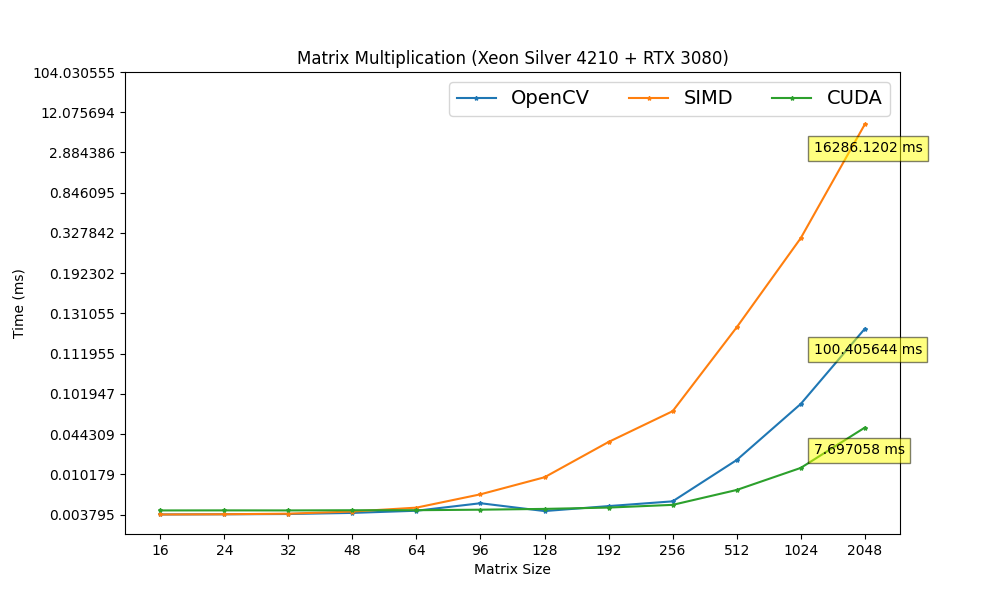
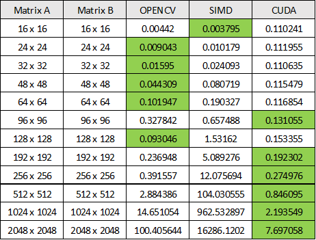

# Matrix Multiplication
Matrix multiplication algorithms implemented using SIMD and CUDA for the optimization.

# Benchmark
  

  
\* The fastest algorithm in each row are highlighted in green  

### Benchmark Environment
CPU: Intel Xeon Silver 4210  
RAM: 96 GB  
OS: Ubuntu 20.04 (WSL 2)  
Compiler: gcc 7.5.0  
CUDA: 11.5  
OpenCV: 4.4.0  
